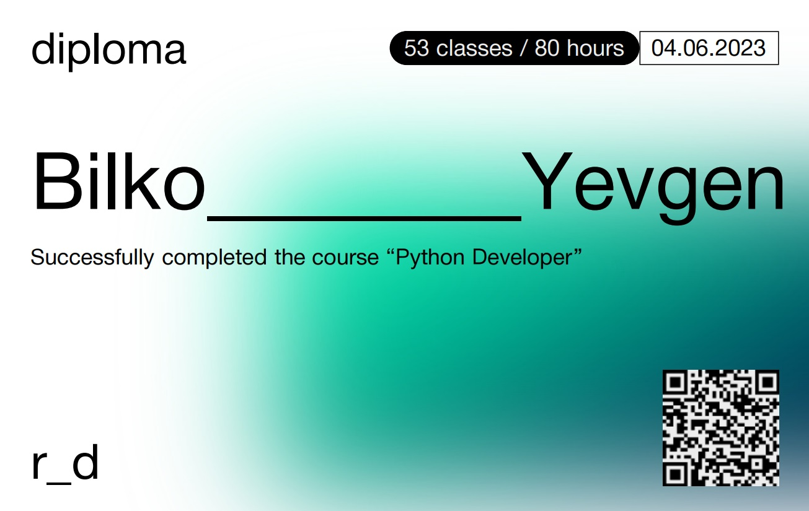

 

<h1 align="center">😲 About Me </h1>

🌱 I’m currently open to work 

⚡ Fun fact **2nd Officer on passenger ships (In a past life)** 

                  
 

<h1 align="center">👩🏼‍💻 Languages and Tools:</h1>

                   

 

<h1 align="center">🤝 Connect with me:</h1>

<h1 align="center">📊 GitHub Stats:</h1>

  
  

<h1 align="center"> 📜 Certifications </h1>

  
  
  
  
  
  

<h1 align="center"> Watch a 🐍 eat my GitHub contributions 🍏.  </h1>

